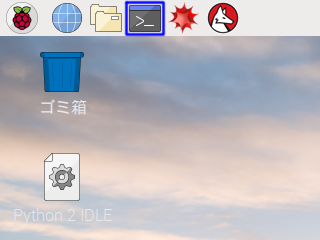

IoTプロトタイピングワークショップ「クラウド概論編」| サンプルプログラム
===============================================================================

What's This?
-------------------------------------------------------------------------------

IoTプロトタイピングワークショップ「クラウド概論編」で使用したサンプルプログラムです。

### 実施実績

- 2018/08/22: IoT・ロボットビジネス創出プログラム「[AIDOR ACCELERATION](https://teqs.jp/acceleration)」第1ターム 基礎知識講座 第3回
- 2018/11/09: [IoTプロトタイピングワークショップ「クラウド概論編」@大阪](https://connpass.com/event/104043/)
- 2018/11/14: IoT・ロボットビジネス創出プログラム「[AIDOR ACCELERATION](https://teqs.jp/acceleration)」第2ターム 基礎知識講座 第3回
- 2019/01/27: [IoTプロトタイピングワークショップ「クラウド概論編」@東京](https://connpass.com/event/113321/)
- 2019/02/12: [IoTプロトタイピングワークショップ「クラウド概論編」@大阪](https://connpass.com/event/113322/)
- 2019/03/24: [IoTプロトタイピングワークショップ「クラウド概論編」@東京](https://connpass.com/event/122115/)


Getting Started
-------------------------------------------------------------------------------

ハードウェア概論編の[セットアップ手順](https://github.com/Guvalif/iot-01/blob/master/README.md)もあわせて行ってください。

Raspberry Piにログインした後、下記画像 青線部内のアイコンをクリックし**ターミナル**を開きます。



**ターミナル**上で、以下のコマンドを入力します：

```sh
sudo pip install boto3 bottle paste websocket-client
```

これにより、

- `bottle`: HTTPサーバを作成するためのライブラリ
- `boto3`: AWSのサービスをPythonから制御するためのライブラリ
- `paste`: 同時アクセス可能なHTTPサーバを作成するためのライブラリ
- `websocket-client`: WebSocketサーバへ接続を行うためのライブラリ

以上4点がインストールされます。


How to Use
-------------------------------------------------------------------------------

[ダウンロードリンク](https://github.com/Guvalif/iot-02/archive/master.zip)をクリックすることで、
プログラムを一式ダウンロードできます。

**ターミナル**上で`sudo idle`と入力し、**Python 2 IDLE**を起動します。
その後、メニューから`File -> Open...`とたどることで、それぞれのプログラムを開くことができます。

プログラムを実行するには、メニューから`Run -> Run Module`とたどります。

なお、同梱されるプログラムは以下の通りです：

- `http`
    - `example_http_v1.py`: センサ・アクチュエータをインターネットリソース化するプログラム
    - `example_http_v2.py`: センサ・アクチュエータのインターネットリソース化とコンテンツ配信を行うプログラム
    - `index_v1.html`: HTMLのみを記述したGUI
    - `index_v2.html`: HTML/CSSを記述したGUI
    - `index_v3.html`: HTML/CSS/JavaScriptを記述したGUI
- `aws`
    - `aws_credentials.py`: AWSの認証情報を記述するライブラリ
    - `example_s3.py`: S3にセンシングしたデータをアップロードするプログラム
    - `example_aws.py`: `example_s3.py` の挙動に加えて、WebSocketサーバとのメッセージ送受信，およびサーボモータを動かすプログラム
- `aws_gui`
    - `assets`: CSS/JavaScript/画像素材を配置したフォルダ
    - `404.html`: エラーページを記述したHTMLファイル
    - `index.html`: GUIを記述したHTMLファイル


More Details
-------------------------------------------------------------------------------

発展課題の詳細解説に関しては、[ANSWER.md](ANSWER.md)をご参照ください。


Copyright (c) 2018,
-------------------------------------------------------------------------------

- [PLEN Project Company Inc.](https://plen.jp)
- [Kazuyuki TAKASE](https://github.com/Guvalif)

This software is released under [the MIT License](http://opensource.org/licenses/mit-license.php).